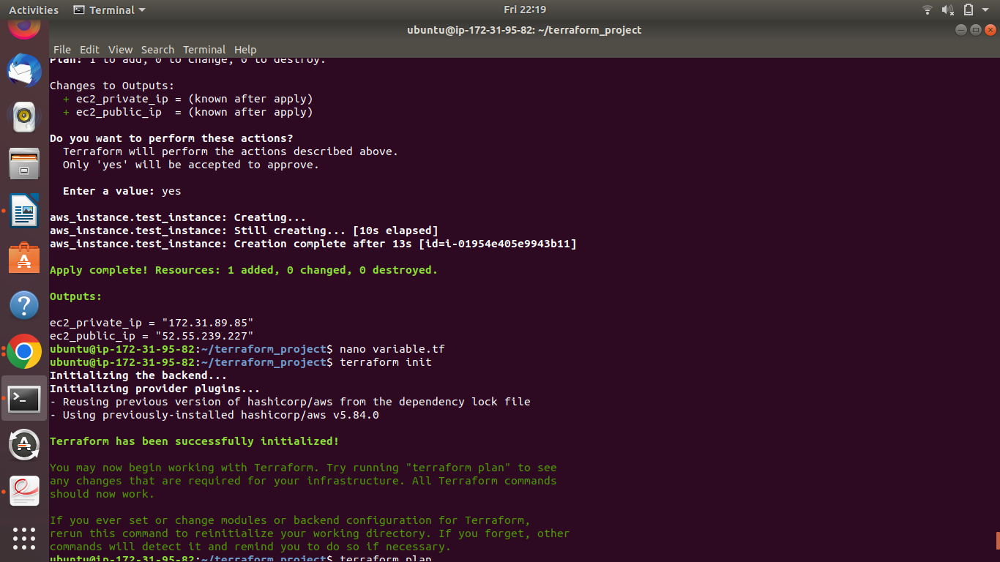
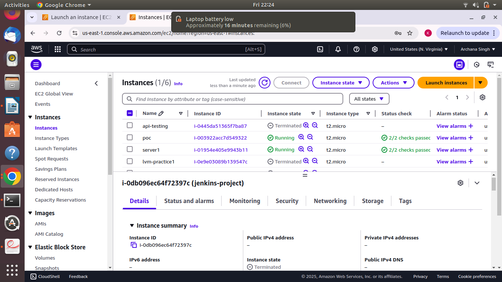

# Terraform Infrastructure Project

This repository contains Terraform configurations for provisioning and managing infrastructure resources, such as EC2 instances, security groups, and other AWS services.

## Project Overview

This project uses Terraform to create, manage, and maintain cloud resources on AWS (or another cloud provider). The configurations are organized into different `.tf` files for modularity and reusability.

## Prerequisites

Before running the Terraform configuration, ensure the following tools are installed:

- **Terraform**: [Download Terraform](https://www.terraform.io/downloads.html)
- **AWS CLI** (for AWS users): [Install AWS CLI](https://aws.amazon.com/cli/)


## Setup Instructions

1. **Create a Directory for the Terraform Project**  
   Run the following commands to create and navigate into the project directory:
   ```bash
   mkdir terraform-project
   cd terraform-project

## 2. Create Terraform Configuration Files

Inside the project directory, create the following files:

- **`provider.tf`**: Defines the AWS provider.  

- **`ec2.tf`**: Contains EC2 instance configurations.  

- **`variables.tf`**: Stores variable definitions.  

- **`output.tf`**: Defines the outputs (such as instance IPs).  
  

3. Initialize Terraform:
   ```bash
   terraform init
   ```
4. Plan the deployment:
   ```bash
   terraform plan
   ```
5. Apply the configuration:
   ```bash
   terraform apply
   
When prompted, confirm by entering "yes".


